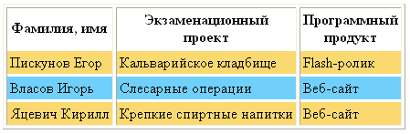
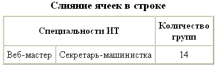
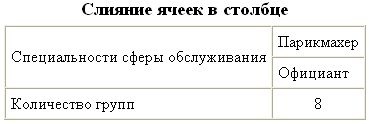
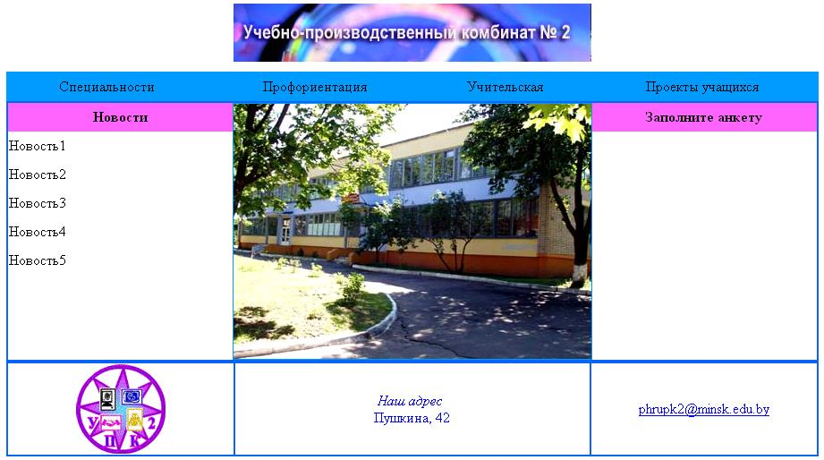

# Занятие 7: Работа с таблицами

**Цель**: создавать простейшие таблицы, оформлять их, выполнять объединение ячеек, создавать веб-страницы на основе табличного дизайна.

!Простейшие таблицы(1.jpg) 
                      
Вставка изображений(2.png)
 
 
                          
 
 
 
   

