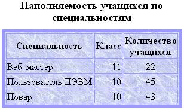
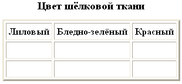

# Занятие 7: Работа с таблицами

**Цель**: создавать простейшие таблицы, оформлять их, выполнять объединение ячеек, создавать веб-страницы на основе табличного дизайна.

                      

 

 
                          

 
 

 
   

